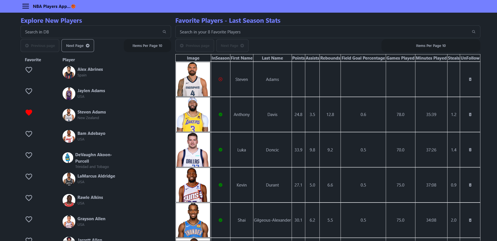

# NBA Players Tracker



## Overview

The NBA Players Tracker is a web application designed to showcase the ability to work with various APIs such as TheSportsDB, BallDontLie, and RoboHash. The application allows users to search for NBA players, view detailed player statistics, and manage a list of favorite players.

## Features

- **Search and Filter**: Search for NBA players by name.
- **Pagination**: Browse through the list of players with pagination support.
- **Favorite Players**: Add players to a favorites list and view their stats.
- **API Integration**: Fetch data from TheSportsDB, BallDontLie, and RoboHash APIs.
- **Error Handling**: Robust error handling and loading states for API requests.
- **Responsive Design**: Works well on various screen sizes.
- **Custom Hooks and Utility Functions**: Well-structured codebase with reusable components.
- **Cache Management**: Efficient caching of API data and images for improved performance.
- **Cache Size Widget**: A draggable and minimizable widget to monitor the cache sizes.

## Technologies Used

- **React**: A JavaScript library for building user interfaces.
- **TanStack React Query**: For fetching, caching, and updating asynchronous data.
- **TanStack React Table**: For building tables with React.
- **Tailwind CSS**: A utility-first CSS framework for rapid UI development.
- **DaisyUI**: Tailwind CSS components plugin.
- **React Icons**: Popular icons for React projects.
- **React Secure Storage**: Secure storage for sensitive data.
- **Vite**: A fast build tool for modern web projects.
- **TypeScript**: A strongly typed programming language that builds on JavaScript.
- **Netlify**: Used for deploying the application with continuous deployment support.

## Installation

1. **Clone the repository**

   ```sh
   git clone https://github.com/your-username/nba-players-tracker.git
   cd nba-players-tracker

   ```

2. Install dependencies

   ```sh
   Copy code
   npm install

   ```

3. Get API Key  
   Obtain an API key from [BallDontLie](https://app.balldontlie.io).

4. Run the application
   ```sh
   Copy code
   npm run dev
   ```

## Demo

Check out the live demo: [NBA Players Tracker](https://main--nba-players-tracker.netlify.app)

The application is deployed on Netlify, providing a fast and reliable hosting solution with continuous deployment from GitHub.

## Screenshots


## Project Demo Recording

[](https://share.vidyard.com/watch/6knLBSQBV2SRUvfyxzEJVQ?)

## API Documentation

- [TheSportsDB](https://www.thesportsdb.com/free_sports_api)
- [BallDontLie](https://docs.balldontlie.io/#introduction)
- [RoboHash](https://robohash.org/)

## Working with Cache

### React Query Cache

The application uses **TanStack React Query** for efficient data fetching and caching. React Query automatically caches API responses to improve performance and reduce unnecessary network requests.

- **Fetching Data**: Data fetching is handled using the `useQuery` hook.
- **Cache Invalidation**: React Query automatically invalidates and refetches data as needed based on query keys.
- **Prefetching**: Data for subsequent pages or related queries can be prefetched using the `prefetchQuery` method to ensure smooth transitions and immediate availability.

### Image Cache

A custom `ImageCache` utility is used to cache player images locally. This helps in reducing the load times for images that have already been fetched.

- **Load Image**: Images are fetched and stored in the cache when first requested.
- **Get Image**: Subsequent requests for the same image retrieve it from the cache.

### Cache Size Widget

The application includes a floating widget to monitor the sizes of the React Query cache and the image cache.

#### Features of the Cache Size Widget

- **Real-Time Updates**: The widget updates in real-time to show the current number of entries and size of the caches.
- **Draggable**: Users can drag the widget to any position on the screen.
- **Minimizable**: The widget can be minimized to an icon in the top-right corner of the screen.
- **Stop Interval on Minimize**: When minimized, the widget stops updating to reduce resource usage.

## Goals

The goal of this project is to demonstrate proficiency in:

- Working with multiple APIs and handling asynchronous data fetching.
- Implementing efficient state management and data caching.
- Creating a responsive and user-friendly interface.
- Utilizing modern web development tools and libraries.

## Contributing

Contributions are welcome! Please open an issue or submit a pull request for any features, bugs, or improvements.

## License

This project is licensed under the MIT License
